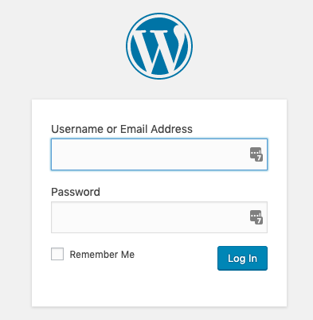
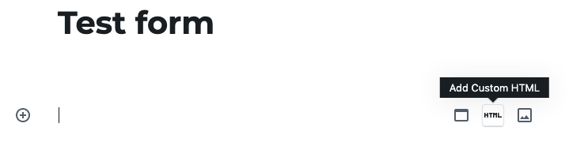
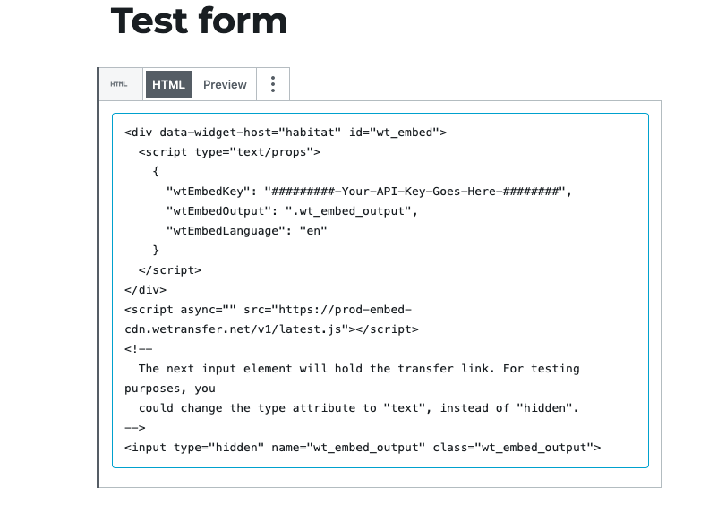
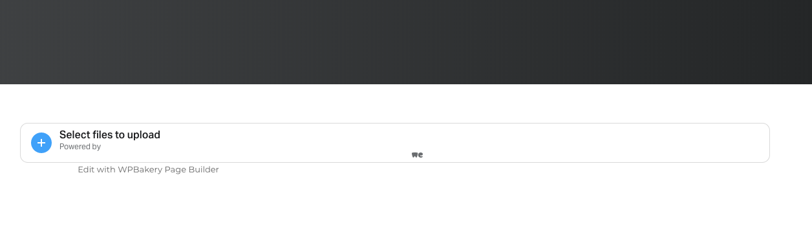

## We-Transfer Embed for Wordpress    

### Wordpress 5.2

**Gutenberg Editor**

Create form from [We-transfer Development Docs](https://developers.wetransfer.com/embed) by following the instructions  sign in with **Github** or **Google** when prompted  

after creating your code snippet login to the **Wordpress Admin** 

then create a test page for the embedded form to be placed on with the add new button. Name the page and begin copying your form from the dashboard of We-transfer login

  

Next create a page title for your site and add an html element from the gutenberg edit by clicking the plus button see image below

  

After the element has been created in the appropriate location of your site **embed** your link from the **We-tranfer dashboard** by clicking the copy button and pasting the script into the gutenberg div.  

  

once the html is added click update and view the page on the front end of your site. below is a screen capture on the front end of our test page. 

